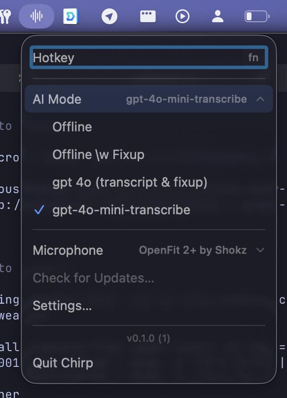
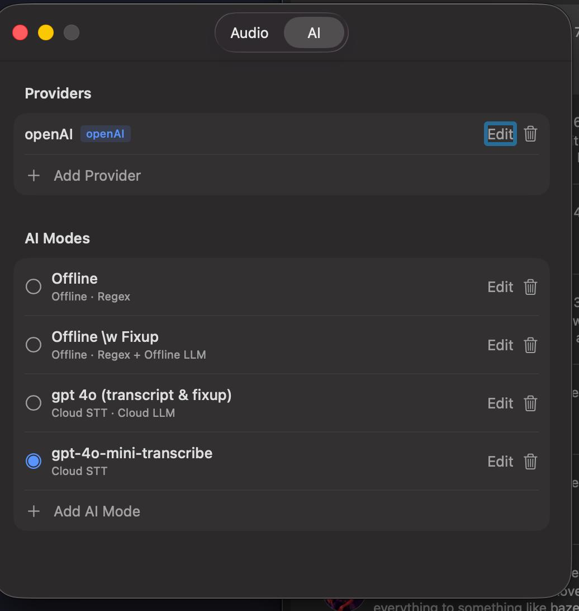
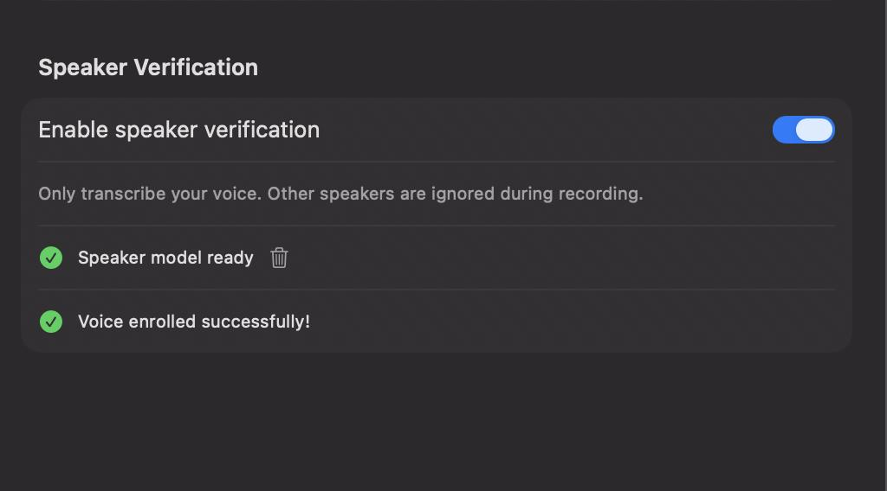

# Chirp

**Free, fast, offline voice-to-text for macOS.**

Hold `fn`, speak, release — text appears at your cursor. Works fully offline by default with no accounts, no servers, and no data leaving your machine. Optionally connect cloud providers for higher-accuracy transcription and AI post-processing.


## Install

### Download

Grab the latest DMG from [GitHub Releases](https://github.com/stefanpenner/chirp/releases), open it, and drag Chirp to Applications.

### Homebrew

```
brew install --cask stefanpenner/chirp/chirp
```

### Build from source

```
brew install bazelisk
bazel run //:Chirp
```

## Features



- **Hold-to-talk** — Press `fn` (configurable) to record, release to transcribe
- **Works everywhere** — Text is typed at your cursor in any app
- **Speculative preview** — See partial transcription as you speak
- **Fast** — Parakeet TDT 0.6b v3 with Silero VAD, all on-device
- **AI Modes** — Pipeline presets switchable from the menu bar. Ships with "Offline" and "Offline + Fixup" (on-device T5 grammar correction); create your own with cloud STT, LLM post-processing, or any combination
- **Cloud providers** — Optional OpenAI, Anthropic, and Google APIs (plus any OpenAI-compatible endpoint)
- **Speaker verification** — Enroll your voice so Chirp only transcribes you, ignoring other speakers
- **Noise reduction** — Apple Voice Processing for noise suppression, echo cancellation, and automatic gain control
- **Menu bar app** — Lives in the menu bar, no dock icon
- **Auto-updates** — Built-in update checks via Sparkle





## Setup

Chirp needs two permissions on first launch:

1. **Microphone** — macOS will prompt automatically
2. **Accessibility** — Required for typing text at your cursor: **System Settings → Privacy & Security → Accessibility**, add Chirp and enable the toggle

On first launch, Chirp downloads the speech recognition model (~465 MB). This is a one-time download stored in `~/Library/Application Support/Chirp/`.

## Updating

Chirp checks for updates automatically. You can also check manually from the menu bar → **Check for Updates…**

```
brew upgrade chirp
```

## Troubleshooting

**Text doesn't appear** — Accessibility permission isn't enabled. Check **System Settings → Privacy & Security → Accessibility**. You may need to remove and re-add Chirp if you moved the app.

**No audio detected** — Check **System Settings → Privacy & Security → Microphone** and ensure Chirp is allowed. Verify your input device in the Chirp menu bar → Microphone.

**Model download fails** — Check your network connection and restart the app. The download resumes where it left off.

## Requirements

- macOS 15+
- ~700 MB disk space (app + model)

## Privacy

In the default offline modes, all processing runs locally. Audio is processed in memory, never recorded or stored. No telemetry, no tracking.

When you use a cloud AI mode, audio or text is sent to the provider you configure. No data is sent unless you explicitly create and activate a cloud mode.

## Acknowledgments

- [sherpa-onnx](https://github.com/k2-fsa/sherpa-onnx) — speech recognition engine (Apache 2.0)
- [ONNX Runtime](https://github.com/microsoft/onnxruntime) — model inference runtime (MIT)
- [NVIDIA Parakeet TDT 0.6b v3](https://huggingface.co/nvidia/parakeet-tdt-0.6b-v2) — speech-to-text model ([CC-BY-4.0](https://creativecommons.org/licenses/by/4.0/))
- [Silero VAD](https://github.com/snakers4/silero-vad) — voice activity detection (MIT)
- [Sparkle](https://github.com/sparkle-project/Sparkle) — auto-update framework (MIT)

Full license texts are in [THIRD_PARTY_NOTICES](THIRD_PARTY_NOTICES).

## Development

```
brew install bazelisk
bazel build //:Chirp           # build
bazel run //:Chirp             # build and launch
bazel test //...               # run tests
bazel run //:package -- 0.3.0  # create signed DMG
```
