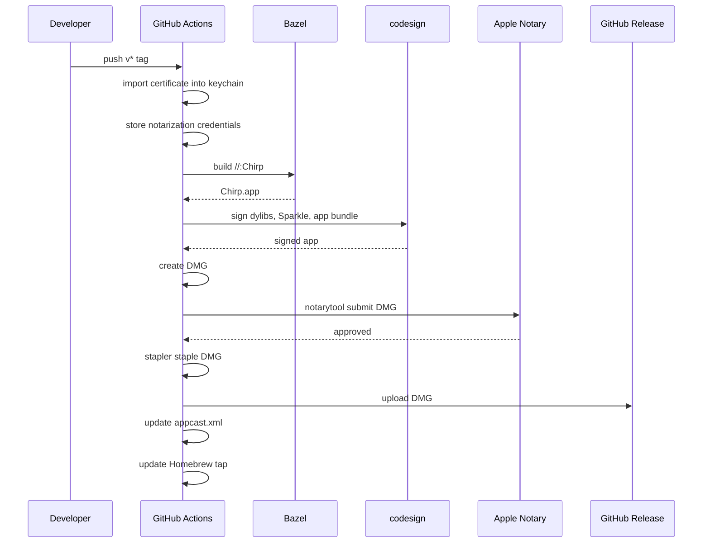

# Code Signing & Notarization

## Overview

Chirp is signed with a Developer ID certificate and notarized by Apple so users can install it without Gatekeeper warnings. The release workflow runs on GitHub Actions; local builds use ad-hoc signing.

## Entitlements

`Sources/Chirp/Chirp.entitlements` grants two capabilities:

- **`com.apple.security.device.audio-input`** — microphone access for speech recognition
- **`com.apple.security.cs.disable-library-validation`** — lets the app load the sherpa-onnx and onnxruntime dylibs, which aren't signed with our team identity

## How `scripts/package.sh` works

1. Builds `Chirp.app` via Bazel and extracts it to `dist/`
2. Stamps the version into `Info.plist`
3. Strips build-time rpaths from the binary (keeps only `@executable_path/../Frameworks`)
4. Signs everything inside-out with hardened runtime:
   - dylibs (`libonnxruntime`, `libsherpa-onnx-c-api`)
   - Sparkle.framework executables
   - the app bundle itself (with entitlements)
5. Verifies the signature (`codesign --verify --deep --strict`)
6. Creates a DMG with an Applications symlink
7. Notarizes the DMG and staples the ticket (when `CHIRP_NOTARIZE_PROFILE` is set)

### Environment variables

| Variable | Default | Purpose |
|---|---|---|
| `CHIRP_SIGNING_IDENTITY` | `-` (ad-hoc) | Code-signing identity name |
| `CHIRP_NOTARIZE_PROFILE` | *(empty — skip)* | Keychain profile for `notarytool` |

## Release sequence



## CI release flow (`.github/workflows/release.yml`)

Triggered by pushing a `v*` tag or manual dispatch.

1. **Import certificate** — decodes the P12 from `APPLE_CERTIFICATE_P12` secret into a temporary keychain, extracts the signing identity
2. **Store notarization creds** — calls `notarytool store-credentials` with the Apple ID, team ID, and app-specific password
3. **Build & package** — runs `scripts/package.sh` which signs, verifies, creates the DMG, notarizes, and staples
4. **Publish** — creates a GitHub Release with the DMG attached
5. **Update appcast** — commits an updated `docs/appcast.xml` for Sparkle auto-updates
6. **Update Homebrew tap** — pushes new version + SHA to `stefanpenner/homebrew-chirp`
7. **Cleanup** — deletes the temporary keychain

### Required secrets

| Secret | What it is |
|---|---|
| `APPLE_CERTIFICATE_P12` | Base64-encoded Developer ID Application certificate + key |
| `APPLE_CERTIFICATE_PASSWORD` | Password for the P12 file |
| `APPLE_ID` | Apple ID email for notarization |
| `APPLE_TEAM_ID` | Apple Developer team ID |
| `APPLE_APP_SPECIFIC_PASSWORD` | App-specific password (generated at appleid.apple.com) |
| `HOMEBREW_TAP_DEPLOY_KEY` | SSH deploy key for the Homebrew tap repo |

## Local builds

```bash
bazel run //:package -- 0.3.0
```

Without `CHIRP_SIGNING_IDENTITY` set, the script ad-hoc signs (`-`) and skips notarization. The resulting DMG works for local testing but will trigger Gatekeeper on other machines (clear with `xattr -cr Chirp.app`).

To sign locally with your own identity:

```bash
CHIRP_SIGNING_IDENTITY="Developer ID Application: Your Name (TEAMID)" \
  scripts/package.sh 0.3.0
```
