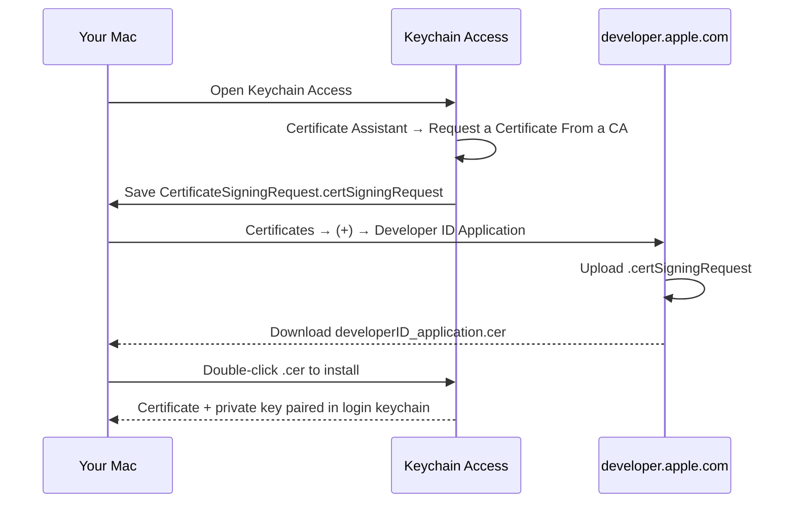
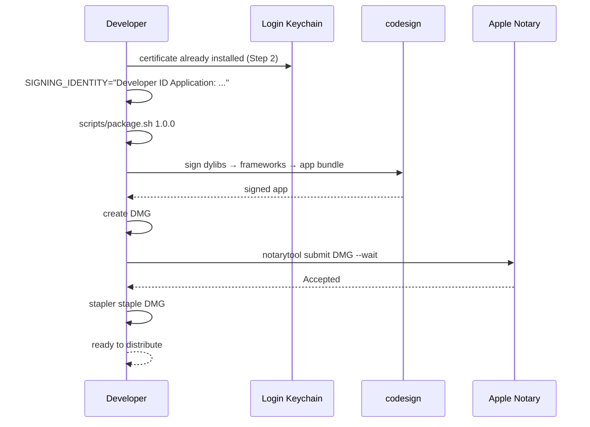

# macOS Code Signing, Notarization & CI Release

A complete guide to setting up Apple code signing and automated GitHub Actions releases for a macOS app distributed outside the App Store.

## Table of contents

1. [Prerequisites](#prerequisites)
2. [Concepts](#concepts)
3. [Local setup](#local-setup)
4. [GitHub Actions setup](#github-actions-setup)
5. [How the release pipeline works](#how-the-release-pipeline-works)
6. [Signing order](#signing-order)
7. [Local signing & testing](#local-signing--testing)
8. [Troubleshooting](#troubleshooting)

---

## Prerequisites

- An [Apple Developer Program](https://developer.apple.com/programs/) membership ($99/year)
- Xcode command-line tools installed (`xcode-select --install`)
- A GitHub repository with Actions enabled
- `gh` CLI (optional, for managing secrets from the terminal)

---

## Concepts

**Developer ID Application certificate** — an Apple-issued identity that proves who built the app. Exported as a `.p12` file containing the certificate + private key. This is the only certificate type that works for apps distributed outside the App Store.

**Hardened runtime** — a macOS security policy (`--options runtime`) that restricts the app at runtime (no unsigned code injection, no DYLD env vars, etc.). Required for notarization. Entitlements opt back into specific capabilities.

**Entitlements** — a plist declaring what the app is allowed to do under hardened runtime:

| Entitlement | When you need it |
|---|---|
| `com.apple.security.device.audio-input` | Microphone access |
| `com.apple.security.cs.disable-library-validation` | Loading dylibs not signed with your team identity |
| `com.apple.security.cs.allow-unsigned-executable-memory` | JIT or plugin hosts |
| `com.apple.security.network.client` | Outbound network (sandboxed apps) |

**Notarization** — you submit a signed `.dmg`/`.zip` to Apple's notary service. Apple scans it, and if it passes, issues a ticket. `stapler staple` embeds that ticket so the app passes Gatekeeper offline.

---

## Local setup

### Step 1: Get your Apple Developer account details

Sign in at [developer.apple.com](https://developer.apple.com/account) and note these values:

| Value | Where to find it | Example |
|---|---|---|
| **Apple ID** | The email you log in with | `you@example.com` |
| **Team ID** | Membership Details → Team ID | `A1B2C3D4E5` |

### Step 2: Create a Developer ID Application certificate



Detailed steps:

1. **Generate a Certificate Signing Request (CSR)**
   - Open **Keychain Access** → Certificate Assistant → **Request a Certificate From a Certificate Authority**
   - Enter your email address and common name
   - Select **Saved to disk**
   - Save the `.certSigningRequest` file

2. **Create the certificate on Apple's portal**
   - Go to [developer.apple.com/account/resources/certificates](https://developer.apple.com/account/resources/certificates/list)
   - Click **+** → select **Developer ID Application**
   - Upload your `.certSigningRequest` file
   - Download the generated `.cer` file

3. **Install the certificate**
   - Double-click the `.cer` file — it installs into your login keychain
   - Open **Keychain Access** → login keychain → My Certificates
   - Verify you see **"Developer ID Application: Your Name (TEAMID)"** with a private key attached

### Step 3: Export the certificate as a P12 file

The `.p12` bundles the certificate + private key into a single encrypted file. CI needs this.

1. In **Keychain Access** → login keychain → **My Certificates**
2. Right-click **"Developer ID Application: Your Name (TEAMID)"** → **Export**
3. Choose format: **Personal Information Exchange (.p12)**
4. Set a strong password — you'll need this as `APPLE_CERTIFICATE_PASSWORD`
5. Save the file (e.g., `developer-id.p12`)

Verify it worked:

```bash
# List identities in the p12
openssl pkcs12 -in developer-id.p12 -nokeys -passin pass:YOUR_PASSWORD | grep subject
```

### Step 4: Generate an app-specific password

Apple requires an app-specific password (not your account password) for notarization from CI.

1. Go to [account.apple.com](https://account.apple.com/) → **Sign-In and Security** → **App-Specific Passwords**
2. Click **Generate an app-specific password**
3. Label it (e.g., "CI Notarization")
4. Copy the generated password (format: `xxxx-xxxx-xxxx-xxxx`)

### Step 5: Verify locally

Test that your signing identity works end-to-end:

```bash
# List available signing identities
security find-identity -v -p codesigning

# You should see something like:
#   1) ABCDEF123456 "Developer ID Application: Your Name (A1B2C3D4E5)"

# Test signing a binary
codesign --force --sign "Developer ID Application: Your Name (A1B2C3D4E5)" \
    --timestamp --options runtime \
    --entitlements YourApp.entitlements \
    YourApp.app

# Verify
codesign --verify --deep --strict YourApp.app
```

Test notarization credentials:

```bash
# Store credentials in a local keychain profile
xcrun notarytool store-credentials "local-notarize" \
    --apple-id "you@example.com" \
    --team-id "A1B2C3D4E5" \
    --password "xxxx-xxxx-xxxx-xxxx"

# Test with a signed DMG
xcrun notarytool submit YourApp.dmg \
    --keychain-profile "local-notarize" \
    --wait
```

---

## GitHub Actions setup

### Collect and configure secrets

You need 5 secrets (and optionally a 6th for Homebrew). Here's how to get each one:

| Secret | Value | How to get it |
|---|---|---|
| `APPLE_CERTIFICATE_P12` | Base64-encoded `.p12` | `base64 -i developer-id.p12 \| pbcopy` |
| `APPLE_CERTIFICATE_PASSWORD` | Password you set when exporting the `.p12` | From Step 3 above |
| `APPLE_ID` | Your Apple Developer email | `you@example.com` |
| `APPLE_TEAM_ID` | 10-character team ID | developer.apple.com → Membership Details |
| `APPLE_APP_SPECIFIC_PASSWORD` | App-specific password | From Step 4 above |
| `HOMEBREW_TAP_DEPLOY_KEY` | SSH private key for Homebrew tap repo (optional) | `ssh-keygen -t ed25519`, add public key as deploy key on tap repo |

Add them to your repo:

```bash
# Via gh CLI
gh secret set APPLE_CERTIFICATE_P12 < <(base64 -i developer-id.p12)
gh secret set APPLE_CERTIFICATE_PASSWORD --body "your-p12-password"
gh secret set APPLE_ID --body "you@example.com"
gh secret set APPLE_TEAM_ID --body "A1B2C3D4E5"
gh secret set APPLE_APP_SPECIFIC_PASSWORD --body "xxxx-xxxx-xxxx-xxxx"

# Or via GitHub UI:
# Settings → Secrets and variables → Actions → New repository secret
```

### Workflow template

Create `.github/workflows/release.yml`:

```yaml
name: Release

on:
  push:
    tags: ["v*"]
  workflow_dispatch:
    inputs:
      version:
        description: "Version to release (e.g. 0.2.0)"
        required: true

permissions:
  contents: write

jobs:
  release:
    runs-on: macos-26
    steps:
      - uses: actions/checkout@v4

      - name: Extract version
        id: version
        run: |
          if [[ -n "${{ inputs.version }}" ]]; then
            echo "version=${{ inputs.version }}" >> "$GITHUB_OUTPUT"
          else
            echo "version=${GITHUB_REF_NAME#v}" >> "$GITHUB_OUTPUT"
          fi

      # 1. Import certificate into a temporary keychain
      - name: Import code-signing certificate
        env:
          APPLE_CERTIFICATE_P12: ${{ secrets.APPLE_CERTIFICATE_P12 }}
          APPLE_CERTIFICATE_PASSWORD: ${{ secrets.APPLE_CERTIFICATE_PASSWORD }}
        run: |
          CERT_PATH="$RUNNER_TEMP/certificate.p12"
          KEYCHAIN_PATH="$RUNNER_TEMP/signing.keychain-db"
          KEYCHAIN_PASSWORD="$(openssl rand -base64 32)"

          echo "$APPLE_CERTIFICATE_P12" | base64 --decode > "$CERT_PATH"

          security create-keychain -p "$KEYCHAIN_PASSWORD" "$KEYCHAIN_PATH"
          security set-keychain-settings -lut 21600 "$KEYCHAIN_PATH"
          security unlock-keychain -p "$KEYCHAIN_PASSWORD" "$KEYCHAIN_PATH"

          security import "$CERT_PATH" \
            -P "$APPLE_CERTIFICATE_PASSWORD" \
            -A -t cert -f pkcs12 \
            -k "$KEYCHAIN_PATH"

          security set-key-partition-list -S apple-tool:,apple: \
            -k "$KEYCHAIN_PASSWORD" "$KEYCHAIN_PATH"

          security list-keychains -d user -s "$KEYCHAIN_PATH" login.keychain-db

          # Extract Developer ID Application identity
          IDENTITY=$(security find-identity -v -p codesigning "$KEYCHAIN_PATH" \
            | grep "Developer ID Application" | head -1 \
            | sed 's/.*"\(.*\)".*/\1/')

          if [[ -z "$IDENTITY" ]]; then
            echo "ERROR: No 'Developer ID Application' certificate found"
            security find-identity -v -p codesigning "$KEYCHAIN_PATH"
            exit 1
          fi

          echo "SIGNING_IDENTITY=$IDENTITY" >> "$GITHUB_ENV"
          echo "Signing identity: $IDENTITY"

      # 2. Store notarization credentials
      - name: Store notarization credentials
        env:
          APPLE_ID: ${{ secrets.APPLE_ID }}
          APPLE_TEAM_ID: ${{ secrets.APPLE_TEAM_ID }}
          APPLE_APP_SPECIFIC_PASSWORD: ${{ secrets.APPLE_APP_SPECIFIC_PASSWORD }}
        run: |
          xcrun notarytool store-credentials "notarize-profile" \
            --apple-id "$APPLE_ID" \
            --team-id "$APPLE_TEAM_ID" \
            --password "$APPLE_APP_SPECIFIC_PASSWORD"

      # 3. Build, sign, notarize (your packaging script)
      - name: Package
        run: scripts/package.sh ${{ steps.version.outputs.version }}

      # 4. Create GitHub Release with DMG
      - name: Create GitHub Release
        uses: softprops/action-gh-release@v2
        with:
          generate_release_notes: true
          files: dist/YourApp-v${{ steps.version.outputs.version }}-macOS.dmg
          tag_name: v${{ steps.version.outputs.version }}

      # 5. Clean up (always — even on failure)
      - name: Clean up keychain
        if: always()
        run: security delete-keychain "$RUNNER_TEMP/signing.keychain-db" 2>/dev/null || true
```

---

## How the release pipeline works

### End-to-end release flow

```mermaid
sequenceDiagram
    participant Dev as Developer
    participant GH as GitHub
    participant CI as CI Runner
    participant Apple as Apple Notary
    participant Dist as Distribution

    Dev->>GH: git tag v1.0.0 && git push --tags

    rect rgb(40, 42, 54)
        Note over CI: CI Runner (macos-26)
        GH->>CI: trigger release workflow

        Note over CI: Certificate Setup
        CI->>CI: decode base64 P12 → certificate.p12
        CI->>CI: create temporary keychain
        CI->>CI: import P12 into keychain
        CI->>CI: extract "Developer ID Application" identity

        Note over CI: Notarization Setup
        CI->>CI: store Apple ID + team ID + app-specific password

        Note over CI: Build
        CI->>CI: build app (bazel/xcodebuild/swift build)

        Note over CI: Sign (inside-out)
        CI->>CI: codesign dylibs (--timestamp)
        CI->>CI: codesign frameworks (--timestamp --options runtime)
        CI->>CI: codesign app bundle (--entitlements --options runtime)
        CI->>CI: codesign --verify --deep --strict

        Note over CI: Package
        CI->>CI: create DMG (hdiutil create)

        Note over CI: Notarize
        CI->>Apple: notarytool submit DMG --wait
        Apple->>Apple: scan binary for malware
        Apple-->>CI: Accepted
        CI->>CI: stapler staple DMG (embed ticket)
    end

    CI->>Dist: upload DMG to GitHub Release
    CI->>Dist: update Sparkle appcast / Homebrew tap
    CI->>CI: delete temporary keychain
```



### Local signing flow



---

## Signing order

Sign inside-out — innermost binaries first, then the outer bundle:

1. Embedded dylibs (`.dylib` files in `Frameworks/`)
2. Embedded frameworks (e.g., Sparkle.framework — sign each executable, then the framework)
3. The app bundle itself (with `--entitlements` and `--options runtime`)

```bash
# 1. Dylibs — timestamp only, no hardened runtime needed
codesign --force --sign "$IDENTITY" --timestamp libfoo.dylib

# 2. Framework executables, then the framework itself
codesign --force --sign "$IDENTITY" --timestamp --options runtime \
    Sparkle.framework/Versions/B/Sparkle
codesign --force --sign "$IDENTITY" --timestamp --options runtime --deep \
    Sparkle.framework

# 3. App bundle — with entitlements and hardened runtime
codesign --force --sign "$IDENTITY" --timestamp --options runtime \
    --entitlements App.entitlements MyApp.app

# Verify
codesign --verify --deep --strict MyApp.app
```

---

## Local signing & testing

### Ad-hoc signing (no certificate needed)

For local development without a signing identity:

```bash
codesign --force --sign - --timestamp --options runtime \
    --entitlements App.entitlements MyApp.app
```

This works on your machine but triggers Gatekeeper elsewhere. Clear quarantine with `xattr -cr MyApp.app`.

### Full local signing

To sign with your real identity and notarize locally:

```bash
# Set environment variables (or export in your shell profile)
export SIGNING_IDENTITY="Developer ID Application: Your Name (A1B2C3D4E5)"
export NOTARIZE_PROFILE="local-notarize"  # from 'notarytool store-credentials'

# Run the packaging script
scripts/package.sh 1.0.0
```

### Trigger a release

```bash
# Option A: push a version tag (triggers CI automatically)
git tag v1.0.0
git push origin v1.0.0

# Option B: manual trigger via gh CLI
gh workflow run release.yml -f version=1.0.0
```

---

## Troubleshooting

| Problem | Fix |
|---|---|
| `errSecInternalComponent` in CI | Keychain locked. Verify `security unlock-keychain` and `set-key-partition-list` both ran successfully. |
| `No 'Developer ID Application' certificate found` | Wrong certificate type in the P12. Must be **Developer ID Application**, not "Apple Development" or "3rd Party Mac Developer". |
| `The signature of the binary is invalid` | Signed out of order. Sign innermost binaries first (dylibs → frameworks → app). |
| Notarization rejects `disable-library-validation` | The dylib using this entitlement must itself be signed (even ad-hoc). |
| `The specified item already exists in the keychain` | P12 was already imported. In CI, ensure the temp keychain is fresh. Locally, check for duplicates in Keychain Access. |
| `DYLD_LIBRARY_PATH` ignored at runtime | SIP strips it. Use `@executable_path/../Frameworks` rpath instead. |
| `resource fork, Finder information, or similar detritus not allowed` | Run `xattr -cr MyApp.app` before signing. |
| Notarization stuck / timeout | Apple's service can be slow. Check [developer.apple.com/system-status](https://developer.apple.com/system-status/) and retry. |
| App-specific password rejected | Regenerate at [account.apple.com](https://account.apple.com/) → Sign-In and Security → App-Specific Passwords. Old passwords may be revoked. |
| `the certificate chain is not valid` | Your intermediate certificate is missing. Download from [Apple PKI](https://www.apple.com/certificateauthority/) and install, or re-download your cert from the portal. |

### Useful diagnostic commands

```bash
# List all signing identities
security find-identity -v -p codesigning

# Inspect what signed a binary
codesign -dvv MyApp.app

# Check entitlements on a signed binary
codesign -d --entitlements - MyApp.app

# Verify signature recursively
codesign --verify --deep --strict --verbose=2 MyApp.app

# Check rpaths on binary
otool -l MyApp.app/Contents/MacOS/MyApp | grep -A2 LC_RPATH

# Check notarization status of a DMG
spctl -a -t open --context context:primary-signature MyApp.dmg

# View notarization history
xcrun notarytool history --keychain-profile "notarize-profile"

# Get notarization log for a submission
xcrun notarytool log <submission-id> --keychain-profile "notarize-profile"
```
