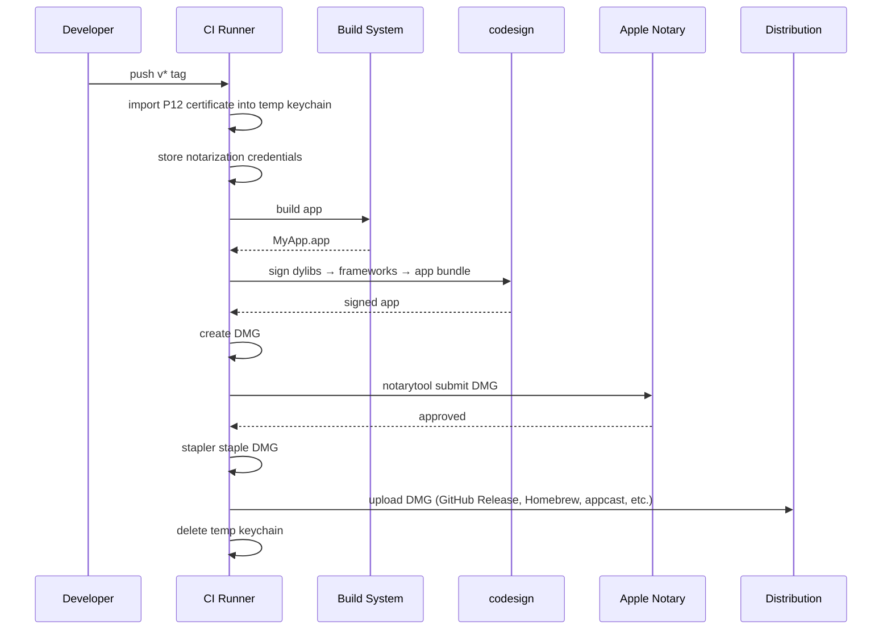

# macOS Code Signing & Notarization

## Overview

macOS apps distributed outside the App Store need two things to avoid Gatekeeper warnings:

1. **Code signing** with a Developer ID Application certificate (hardened runtime enabled)
2. **Notarization** — Apple scans the app and issues a ticket that Gatekeeper trusts

This project automates both via a packaging script and a GitHub Actions release workflow.

## Concepts

**Developer ID Application certificate** — an Apple-issued identity that proves who built the app. Exported as a `.p12` file containing the certificate + private key.

**Hardened runtime** — a macOS security policy (`--options runtime`) that restricts the app at runtime (no unsigned code injection, no DYLD env vars, etc.). Required for notarization. Entitlements opt back into specific capabilities.

**Entitlements** — a plist declaring what the app is allowed to do under hardened runtime. Common ones:

| Entitlement | When you need it |
|---|---|
| `com.apple.security.device.audio-input` | Microphone access |
| `com.apple.security.cs.disable-library-validation` | Loading dylibs not signed with your team identity |
| `com.apple.security.cs.allow-unsigned-executable-memory` | JIT or plugin hosts |
| `com.apple.security.network.client` | Outbound network (sandboxed apps) |

This project uses: `audio-input` (speech recognition) and `disable-library-validation` (third-party dylibs).

**Notarization** — you submit a signed `.dmg`/`.zip` to Apple's notary service. Apple scans it, and if it passes, issues a ticket. `stapler staple` embeds that ticket so the app works offline.

## Signing order

Sign inside-out — innermost binaries first, then the outer bundle:

1. Embedded dylibs (`.dylib` files in `Frameworks/`)
2. Embedded frameworks (e.g. Sparkle.framework — sign each executable, then the framework)
3. The app bundle itself (with `--entitlements` and `--options runtime`)

```bash
# 1. Dylibs
codesign --force --sign "$IDENTITY" --timestamp libfoo.dylib

# 2. Framework executables, then the framework
codesign --force --sign "$IDENTITY" --timestamp --options runtime \
    Sparkle.framework/Versions/B/Sparkle
codesign --force --sign "$IDENTITY" --timestamp --options runtime --deep \
    Sparkle.framework

# 3. App bundle
codesign --force --sign "$IDENTITY" --timestamp --options runtime \
    --entitlements App.entitlements MyApp.app

# Verify
codesign --verify --deep --strict MyApp.app
```

## Release sequence



## GitHub Actions setup

### Secrets you need

| Secret | What it is |
|---|---|
| `APPLE_CERTIFICATE_P12` | Base64-encoded `.p12` (`base64 -i cert.p12 \| pbcopy`) |
| `APPLE_CERTIFICATE_PASSWORD` | Password for the `.p12` |
| `APPLE_ID` | Apple ID email |
| `APPLE_TEAM_ID` | 10-character team ID from developer.apple.com |
| `APPLE_APP_SPECIFIC_PASSWORD` | Generated at appleid.apple.com under Sign-In and Security |

### Workflow steps

```yaml
# 1. Import certificate into a temporary keychain
- name: Import certificate
  env:
    APPLE_CERTIFICATE_P12: ${{ secrets.APPLE_CERTIFICATE_P12 }}
    APPLE_CERTIFICATE_PASSWORD: ${{ secrets.APPLE_CERTIFICATE_PASSWORD }}
  run: |
    CERT_PATH="$RUNNER_TEMP/certificate.p12"
    KEYCHAIN_PATH="$RUNNER_TEMP/signing.keychain-db"
    KEYCHAIN_PASSWORD="$(openssl rand -base64 32)"

    echo "$APPLE_CERTIFICATE_P12" | base64 --decode > "$CERT_PATH"

    security create-keychain -p "$KEYCHAIN_PASSWORD" "$KEYCHAIN_PATH"
    security set-keychain-settings -lut 21600 "$KEYCHAIN_PATH"
    security unlock-keychain -p "$KEYCHAIN_PASSWORD" "$KEYCHAIN_PATH"
    security import "$CERT_PATH" \
      -P "$APPLE_CERTIFICATE_PASSWORD" \
      -A -t cert -f pkcs12 -k "$KEYCHAIN_PATH"
    security set-key-partition-list -S apple-tool:,apple: \
      -k "$KEYCHAIN_PASSWORD" "$KEYCHAIN_PATH"
    security list-keychains -d user -s "$KEYCHAIN_PATH" login.keychain-db

    IDENTITY=$(security find-identity -v -p codesigning "$KEYCHAIN_PATH" \
      | head -1 | sed 's/.*"\(.*\)".*/\1/')
    echo "SIGNING_IDENTITY=$IDENTITY" >> "$GITHUB_ENV"

# 2. Store notarization credentials
- name: Store notarization credentials
  env:
    APPLE_ID: ${{ secrets.APPLE_ID }}
    APPLE_TEAM_ID: ${{ secrets.APPLE_TEAM_ID }}
    APPLE_APP_SPECIFIC_PASSWORD: ${{ secrets.APPLE_APP_SPECIFIC_PASSWORD }}
  run: |
    xcrun notarytool store-credentials "notarize-profile" \
      --apple-id "$APPLE_ID" \
      --team-id "$APPLE_TEAM_ID" \
      --password "$APPLE_APP_SPECIFIC_PASSWORD"

# 3. Build, sign, notarize (your packaging script)
- name: Package
  run: scripts/package.sh ${{ steps.version.outputs.version }}

# 4. Clean up (always — even on failure)
- name: Clean up keychain
  if: always()
  run: security delete-keychain "$RUNNER_TEMP/signing.keychain-db" 2>/dev/null || true
```

## Local development

Without a signing identity, ad-hoc sign for local testing:

```bash
# Ad-hoc (default when SIGNING_IDENTITY is unset or "-")
codesign --force --sign - --timestamp --options runtime \
    --entitlements App.entitlements MyApp.app
```

This works on your machine but triggers Gatekeeper elsewhere. Clear it with `xattr -cr MyApp.app`.

To sign with your real identity locally:

```bash
SIGNING_IDENTITY="Developer ID Application: Your Name (TEAMID)" \
  scripts/package.sh 0.3.0
```

## Troubleshooting

| Problem | Fix |
|---|---|
| `errSecInternalComponent` in CI | The keychain is locked. Make sure `security unlock-keychain` and `set-key-partition-list` both ran. |
| `The signature of the binary is invalid` | You signed out of order. Sign innermost binaries first. |
| Notarization rejects `disable-library-validation` | The dylib using this entitlement must itself be signed (even ad-hoc). |
| `DYLD_LIBRARY_PATH` ignored at runtime | SIP strips it. Use `@executable_path/../Frameworks` rpath instead. |
| `resource fork, Finder information, or similar detritus not allowed` | Run `xattr -cr MyApp.app` before signing. |
